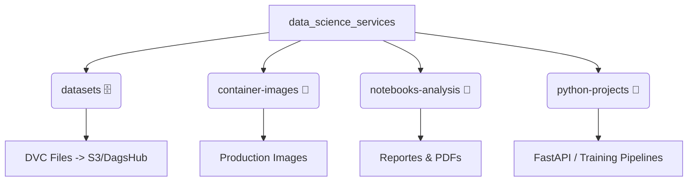

# ⚡ DATA SCIENCE SERVICES ⚡
<!-- Title Banner with Neon Style Badges -->

 

**Una implementación de referencia para la Ingeniería de Datos y Machine Learning en el Mundo Real.**

[Explorar Proyectos](#-proyectos-python) • [Arquitectura](#-arquitectura-del-repositorio) • [Tecnologías](#-stack-tecnológico)

---

## 🔮 La Visión
> *"La diferencia entre un notebook y un producto es la ingeniería."*

Este repositorio no es solo una colección de scripts; es una **demostración viva** de cómo estructurar proyectos de Ciencia de Datos siguiendo los más altos estándares de la industria. Aquí rompemos la barrera entre el análisis exploratorio y el software de producción.

El objetivo es mostrar el **Ciclo Completo de Desarrollo (CI/CD)**, integrando prácticas de **MLOps** para garantizar que los modelos no solo funcionen en una máquina local, sino que escalen y sirvan valor en el mundo real.

---

## 🧬 Arquitectura del Repositorio

La estructura ha sido diseñada modularmente para separar responsabilidades (Data, Research, Infraestructura, Code).

### 📂 Desglose de Directorios

#### 1. `datasets/` 🗄️
**"La Fuente de la Verdad."**
Aquí no encontrarás gigabytes de CSVs crudos. Este directorio actúa como un índice inteligente.
*   **Gestión con DVC (Data Version Control):** Almacenamos archivos `.dvc` (metadatos) que apuntan a nuestro almacenamiento remoto (S3, DagsHub, Azure Blob).
*   **Descarga Eficiente:** Permite al equipo descargar solo la versión exacta de los datos necesaria para reproducir un experimento específico.

#### 2. `container-images/` 🐳
**"Listos para el Despegue."**
Contiene las definiciones de infraestructura inmutable.
*   Aquí residen los `Dockerfiles` base y configuraciones optimizadas para entornos de producción.
*   Garantiza que "funciona en mi máquina" signifique "funciona en producción".

#### 3. `notebooks-analysis/` 🔬
**"El Laboratorio de Ideas."**
El espacio para la creatividad y la exploración estadística.
*   Contiene **Jupyter Notebooks** para EDA (Exploratory Data Analysis) y prototipado rápido.
*   Incluye versiones en **PDF** de los análisis para facilitar la lectura y divulgación de insights a stakeholders no técnicos.

#### 4. `python-projects/` 🐍
**"El Motor de Producción."**
Donde el código se vuelve profesional. Aquí residen las aplicaciones estructuradas.
*   **Modularidad:** Código fuente organizado en paquetes, separado de la lógica de notebooks.
*   **Microservicios:** APIs (ej. FastAPI), pipelines de entrenamiento y clientes de consumo.
*   **Calidad:** Testing, Linting y Type Checking configurados.

---

## 🚀 Proyectos Destacados

| Proyecto | Descripción | Estado |
| :--- | :--- | :---: |
| **Credit Score AI** | **[Completado]** Evaluación de riesgo crediticio E2E. Incluye preprocesamiento robusto, entrenamiento de modelos, API con FastAPI y un cliente web interactivo.   📺 **[Vídeo 1: Explicación y Demo](https://youtu.be/S5j4cSOEyik)**   🚀 **[Vídeo 2: Despliegue del Servicio](https://youtu.be/V2LokJd68bU)**   🔗 **[Ir al proyecto Credit Score AI](python-projects/credit-score/README.md)** |  |
| **Energy Imports** | *Work in progress*. Análisis y predicción de importaciones de energía. Se desplegará prontamente. |  |
| **Retail Sales** | *Work in progress*. Optimización y pronóstico de ventas para retail. Se desplegará prontamente. |  |
| **X-ray Diagnosis** | *Work in progress*. Clasificación de imágenes médicas mediante Deep Learning. Se desplegará prontamente. |  |
| **API Consumption** | *Work in progress*. Módulo especializado en la integración y consumo eficiente de APIs externas. Se desplegará prontamente. |  |

---

## 🛠 Stack Tecnológico

  

- **Lenguaje:** Python 3.10+
- **Control de Versiones:** Git & DVC
- **Contenedores:** Docker & Docker Compose
- **Orquestación:** GitHub Actions (CI/CD)
- **Frameworks ML:** Scikit-Learn, TensorFlow/PyTorch
- **API:** FastAPI

---

Hecho con ❤️ para la comunidad de Data Science.

