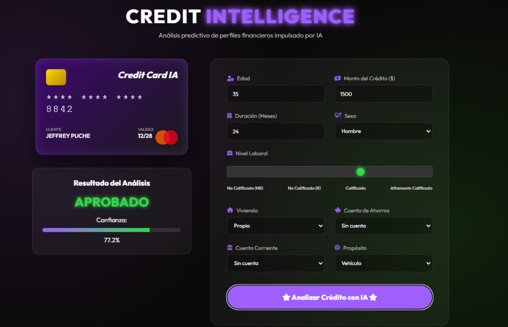

# 💳 Credit Score AI Engine: MLOps & DevOps Edition


<div align="center">
  
</div>

---

## 🚀 Descripción del Proyecto

**Credit Score AI Engine** es una solución de vanguardia diseñada para predecir la solvencia crediticia mediante una **Red Neuronal Profunda (Deep Neural Network)** construida con **PyTorch**.

Este proyecto trasciende el modelado tradicional; es una implementación de referencia de **Buenas Prácticas de DevOps** y **MLOps**. Está arquitectado para soportar el ciclo de vida completo de la **IA Engineering**, desde la experimentación científica hasta el despliegue en producción con integración continua, asegurando robustez, escalabilidad y mantenibilidad.

---

## 📺 Video Demo
Puedes ver una explicación detallada de este proyecto y su funcionamiento en el siguiente vídeo:

<div align="center">
  <a href="https://www.youtube.com/watch?v=S5j4cSOEyik">
    
  </a>
  <br>
  <a href="https://www.youtube.com/watch?v=S5j4cSOEyik">
    
  </a>
</div>

---

### 💡 Filosofía DevOps & IA Engineering
El núcleo de este proyecto demuestra cómo cerrar la brecha entre la ciencia de datos y la **IA Engineering**:
*   **Modularidad Extrema:** Arquitectura desacoplada donde la lógica de negocio, el entrenamiento y la inferencia viven en capas separadas.
*   **Reproducibilidad Estricta:** Gestión de entornos deterministas con `uv` y `docker`.
*   **Tracking:** Integración profunda con **MLflow** para el rastreo de métricas, parámetros y artefactos de modelos.
*   **Containerización:** Entornos aislados para API y Clientes asegurando consistencia "Build once, run anywhere".

---

## 🔮 Potenciales Escenarios de Impacto

Este motor de Scoring Crediticio está diseñado para revolucionar la toma de decisiones financieras en múltiples verticales:

1.  **🏦 Neobancos & Fintechs:** Motores de decisión en tiempo real para aprobar tarjetas de crédito virtuales en milisegundos, reduciendo drásticamente el Costo de Adquisición de Cliente(CAC).
2.  **🛍️ E-commerce (Buy Now, Pay Later):** Integración nativa en pasarelas de pago para ofrecer financiación instantánea basada en comportamiento de usuario.
3.  **🏠  Proptech & Alquileres:** Evaluación de riesgo para inquilinos en tiempo real, agilizando la firma de contratos de arrendamiento y seguros de impago.
4.  **📱 Telecomunicaciones:**  Aprobación dinámica de planes pospago y subsidio de equipos de gama alta basada en la probabilidad de tasa de cancelación o abandono de clientes y pago.
5.  **🚜 Inclusión Financiera (Microfinanzas):** Modelos alternativos para puntuar a poblaciones no bancarizadas basándose en huella digital y transaccionalidad menor utilizando datos demográficos y transaccionalidad no tradicional.
6.  **⚖️ Insurtech:** Sector Asegurador:** Ajuste dinámico de primas de seguros basado en el perfil de riesgo financiero del asegurado (correlación riesgo-financiero).


---

## 🧬 Anatomía del Proyecto: Arquitectura y Tecnologías

A continuación, se detalla la estructura profunda del proyecto y la justificación técnica de cada componente.

### 📂 Estructura de Directorios

```text
credit-score/
├── .venv/                      # Entorno virtual gestionado por UV
├── config/                     # ⚙️ CONFIGURACIÓN CENTRALIZADA
│   ├── logs_configs/           # Configuración de observabilidad y logging
│   └── models-configs/         # Hiperparámetros de modelos (YAML)
│       ├── model_config_000.yaml
│       ├── model_config_001.yaml
│       ├── model_config_002.yaml
│       └── ...
├── examples/                   # 🎮 DEMOS Y CLIENTES
│   └── client_web/             # Interfaz de Usuario (Frontend + BFF)
├── inference/                  # 🧠 MOTOR DE INFERENCIA
│   └── inference.py            # Lógica para cargar pesos del modelo y predecir
├── mlruns/                     # 📊 ALMACÉN DE MLFLOW (Métricas/Modelos)
├── model/                      # 📐 ARQUITECTURA DE LA RED
│   └── model.py                # Definición de la clase PyTorch (nn.Module)
├── processing/                 # 🧹 INGENIERÍA DE DATOS
│   └── preprocessor.py         # Pipelines de limpieza y transformación
├── server/                     # 🚀 API GATEWAY
│   ├── api.py                  # Endpoints REST (FastAPI)
│   └── schemas.py              # Contratos de datos (Pydantic)
├── training/                   # 🏋️‍♀️ LABORATORIO DE ENTRENAMIENTO
│   └── training.py             # Script de entrenamiento y validación
├── dev_requirements.txt        # Dependencias de desarrollo
├── docker-compose.yml          # Orquestación de servicios
├── Dockerfile.api              # Receta de imagen para el Backend
├── Dockerfile.client           # Receta de imagen para el Frontend
├── pyproject.toml              # Definición del proyecto (Modern Python)
└── uv.lock                     # Sellado de versiones (Reproducibilidad)
```

### 🛠️ Justificación del Stack Tecnológico

1.  **PyTorch (`model/`):** Elegido por su grafos de computación dinámicos y facilidad para prototipar arquitecturas de redes neuronales complejas y customizables.
2.  **FastAPI (`server/`):** El estándar moderno para APIs en Python. Ofrece alto rendimiento (asíncrono) y generación automática de documentación (Swagger UI).
3.  **Pydantic (`server/schemas.py`):** Garantiza la validación estricta de datos en tiempo de ejecución, fundamental para que el modelo no reciba basura (Garbage In, Garbage Out).
4.  **UV (Gestor de Paquetes):** Reemplazo ultra-rápido de pip/poetry. Asegura instalaciones deterministas y veloces.
5.  **MLflow (`mlruns/`):** La columna vertebral de MLOps. Permite versionar no solo el código, sino los *datos*, los *parámetros* y los *modelos resultantes*.
6.  **Docker & Compose:** Garantiza que el entorno de ejecución sea idéntico en la laptop del desarrollador y en el servidor de producción.
7.  **DVC:** Control de versiones de datos. Permite versionar los datos de entrenamiento y validación. Extiende las capacidades de Git para gestionar grandes volúmenes de datos y artefactos

---

## ⚡ Guía de Inicio Rápido (UV Edition)

Este proyecto utiliza `uv` para una gestión de dependencias superior. Asegúrate de tenerlo instalado.


### 1. Preparación del Entorno y MLflow
Antes de entrenar, necesitamos el sistema de tracking activo.

```bash
# 1. Instalar dependencias
uv sync  # O pip install -r requirements.txt si no usas uv aun

# 2. Iniciar la UI de MLflow (en una terminal aparte)
# Esto te permitirá visualizar las curvas de pérdida y accuracy en tiempo real.
uv run mlflow ui
```
*Accede al dashboard de experimentos en: `http://127.0.0.1:5000`*

### 2. Entrenamiento del Modelo (Training Pipeline)
El entrenamiento es configurable mediante archivos YAML. No necesitas tocar código para probar diferentes hiperparámetros (learning rate, capas, neuronas).

**Cómo crear una configuración:**
1.  Ve a `config/models-configs/`.
2.  Crea un archivo (ej: `mi_experimento.yaml`) o usa uno existente.
3.  Define tus parámetros:
    ```yaml
    hyperparameters:
      learning_rate: 0.001
      batch_size: 64
      epochs: 20
    ```

**Comando de ejecución:**
```bash
# Ejecuta el entrenamiento apuntando a tu configuración
uv run training/training.py --config config/models-configs/model_config_001.yaml
```
*Al finalizar, el modelo entrenado se guardará automáticamente en `mlruns/` y se registrará como listo para producción.*

### 3. Despliegue de Servicios (API & UI)

Una vez entrenado el modelo, levanta la arquitectura de servicios.

**Backend (API de Inferencia):**
```bash
# Inicia el servidor de alto rendimiento
uv run uvicorn server.api:app --reload --port 8000
```
*Swagger Docs: `http://localhost:8000/docs`*

**Frontend (Interfaz de Usuario):**
```bash
# Inicia la aplicación web de demostración
uv run uvicorn examples.client_web.main:app --reload --port 3000
```
*App Web: `http://localhost:3000`*

---

## 🐳 Despliegue con Docker (Producción)

Para un despliegue "cero configuración" utilizando contenedores:

```bash
# Construir y levantar todo el ecosistema
docker-compose up --build
```
Esto orquestará automáticamente:
1.  La API de Inferencia (Puerto 8000)
2.  La Web App del Cliente (Puerto 3000)


